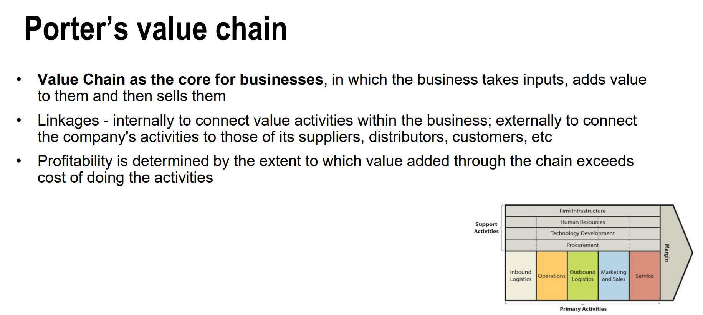
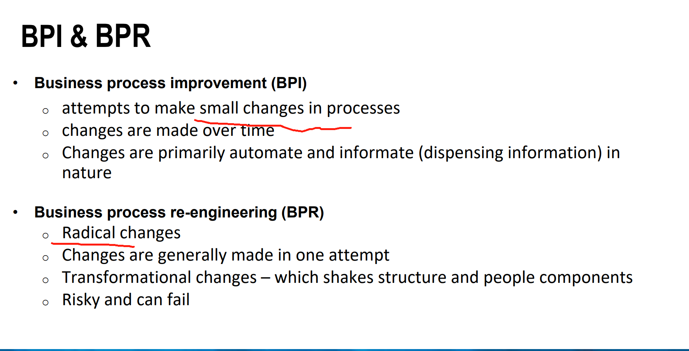

warning: for assignments you need to do further researches and make sure all what you're writing includes references

## Read this book:Nicholas Carr , IT doesnt matter
## Using artificial intelligence for quantifying strategic business-IT alignment 
## for assignment 1 you need to plugged in AI, its an AI stuff
minimum 10 references(from the materials tutor provide)
2000 words maximum(better be 1800)
example:

check this file:

# report citation
https://guides.lib.monash.edu/apa-7/government-business-reports

dont forget to make the assignmentmore like a research

# Citation
use apa 7 citation
do not include author's first name

pick 2 to 3 cases and pintch to important points 
## Assignment 2
introduce , clarly point out issues

reference book:
Carr, N. “IT Doesn’t Matter,” Harvard Business Review (81:5), 2003, pp. 41-50.

tips when choosing references：
authors more than 3
minimum 8 references, usually more than 10

# how to write in the final exam:
must include key point
if you dont know how to write:
search for this thesis on google scholar: The Relationship between Strategic Information
Systems Planning Facilitators and the Success of
South Korean Organisations
## in the final exam you need to read an article and answer 8-12 questions.

### in final exam there will be knowledge outside the course

these questions will be in final exam:
Case study (a case with 5-6 questions)
 
 

strategy:
(the tutor always talk about the monash university 5-year strategy plan)

Governance

## Week2

## week3

in week 3 contains 30% of the resources in final exam
in final exam you need to describe

cmpetitive advantage

### strategy formulate process:
Strategies should
focus on how to use
IT to improve/ create
value by enhancing
any of these activities. 

How to achieve the advantage using business strategy

### Business Strategy as the driver

### describe difference between BPI & BPR

why BPR?

### you need to answer at least 5 reasons( inhibit of strategy alignment)

## in the final exam when you explain a case, you need to describe its business strategy:
for example cost leadership like how do they keep the cost low, how to maintain profits

Overall, every organisation has different characteristics, environment and structure to manage and run their business
thus, companies must carefully consider their unique circumstances, industry dynamics, and market conditions when applying these frameworks to ensure relevance effectiveness.

questions:
What is the main argument presented by Nicholas Carr in the article?
• How does Carr define "commodity technology," and why does he argue that IT has
become one? What are the reasons for Carr’s arguments?
• Do you agree or disagree with the author’s argument?
• How does he support his claims?
### • What is the difference between “strategic IT” versus “commodity IT”?
Difference Between "Strategic IT" and "Commodity IT":

Strategic IT: Refers to innovative and proprietary technologies that provide a company with a distinct competitive edge, often through unique applications or processes tailored to specific business strategies.​

Commodity IT: Encompasses widely available and standardized technologies essential for operations but do not confer unique advantages, as they are easily replicable by competitors.

• Since Carr’s article was published in 2003 do you think his arguments would still hold considering the technological changes in businesses?
it is because the landscape of IT and business strategy has undoubtedly and continuously evolved.

### notes: check your email and download the files

### Resource-Based View(RBV)
ultimate goal: idnetify and leverage unique , valuable resources that competitiors cannot easily copy, leading to sustained competitive advantage.
Tangible : Physical assets
Intangible: Brand, patents, culture etc.
Capabilities: Skills, processes, knowledge etc

### VRIO Model
V-Valuable : Does the resource/capability help the organisation exploit opportunities or neutralise threats?
Strategic Outcome: Competitive parity

R-Rare: Is it possessed by few or no competitors?
Strategic Outcome: Temporary advantage

I-Inimitable: Is it costly or difficult for competitors to imitate?
Strategic Outcome: Likely sustained advantage

O- Organisation: is the organisation organised to capture value from the resource/capability?
Strategic Outcome: Sustained advantage 

# Assignment 1: if you look of reports from companies, go to for example woolworth --investors---reports
you can also referring Balances scorecard from week4
why using AI(AI should be include in assignment)

week4

### final exam: relationship between enablers and inhibitors

### Strategic alignment focuses

### Strategic alignment maturity levels

(question in final exam: why most of the companies stay in level 3 and other why at level 5)

### this is used in many organisations

give answers about customer, financial, internal business processes and learning and growth.

1. Financial
2. Customer (stakeholders)
3. Internal business processes
4. Learning and Growth

### corporate governance

pinball
thats what most of the large organisations following

### IT Governance

# final exam questions:
IT governance focused areas:
• Value delivery
• Strategic alignment
• Performance measurement
• Resource management
• Risk management

### final exam reference:

# BSC:
Balanced Scorecard (BSC) can provide a balanced presentation of both financial and
operational measures (customer, internal business processes, and learning & growth).
• BSC looks forward, not backward. It is centered on vision and strategy.
• BSC can be adapted for IT governance, for example, by focusing on corporate
contribution, customer/ user/ stakeholders, operational excellence, and future orientation. 

# week5 
## KM
definition
### knowledge management

### data information knowledge

### knowledge convert

### value of knowledge

### knowledege type

### knowledge management tools

### practice (there will be one in final exam, and you need to describe why)
For each of the following, is it
a) Declarative or Procedural
b) Explicit or Tacit
c) General, Contextually Specific or Technically Specific
Basic knowledge of the steps to take in deciding whether to buy a company’s stock----------Procedural knowledge
A book describing the factors to consider when deciding whether to buy a company's----------Tacit Knowledge
stock, e.g. price to learning ratio, dividends, etc.
A book describing steps to take in deciding whether to buy a company’s stock
FIT5102, 2025 - IT Strategy & Governance
Knowledge of the major factors to consider when deciding whether to buy a company’s
stock
### A company document identifying the sequence of actions a consultant’s team manager should take when requesting senior management to replace a team member having problems with the project they have been assigned to---final exam

### A company document identifying the circumstances under which a consultant’s team managershould consider replacing a team member having problems with the project they have been assigned to.---final exam
A HR manager’s knowledge of factorsto consider in motivating an employer in a particular
company
A HR manager’s knowledge of steps to take in motivating an employer in a particular
company
A manual describing how to change computer operating system settings to achieved
desired performance outcomes
A manual describing factors to consider in configuring a computer to achieve desired
performance outcomes
A technician’s knowledge of the sequence of steps to take in diagnosing a computer fault
A technician’s knowledge of the things to look for in diagnosing a computer fault.

# week6

## intellectual property

## KM foundations

## knowledge management foundation

## knowledge management process

## km solutions

In summary, KM, IC and IT governance are interwined with KM driving IC development and IT governance providing the necessary
infrastructure and security for effective knowledge management.

## Value of Tacit and Explicit knowledge

# governance vs Management
file: Week 7 - Key takeaways(The concept...)

# IT/IS Strategy report
## 1. what do you want to see from an IS/IT strategy Report?

# week8
## DVP warning

# week9
Strategic Drift

Risk response Strategy

enterprise governance

### Enterprise governance vs Corporate governance

if you dont know how to answer question in final exam, answer : Aligmnet, knowledge sharing, communications

watch Tutorial 9: activity 9. this will be quite similar to the final exam question.

# policy: data goverance

## Assignment 2
you must use materials from week7 and week 9
