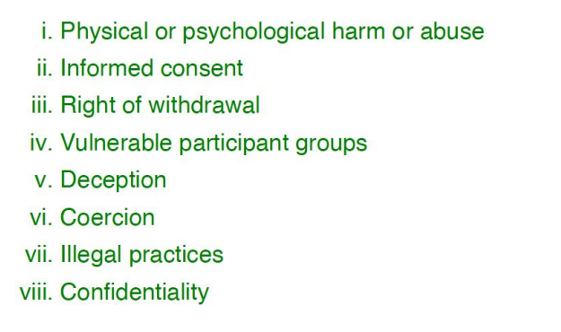
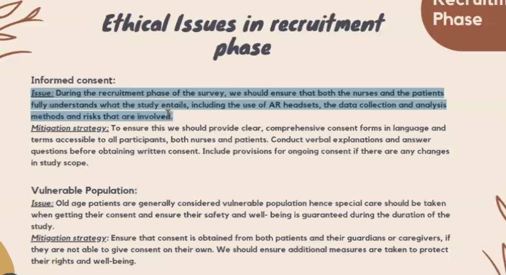
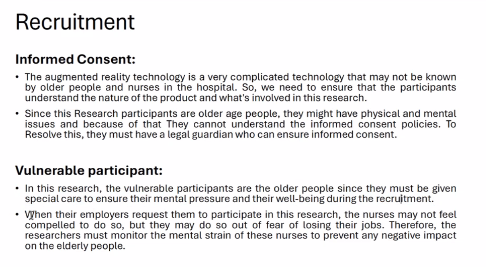
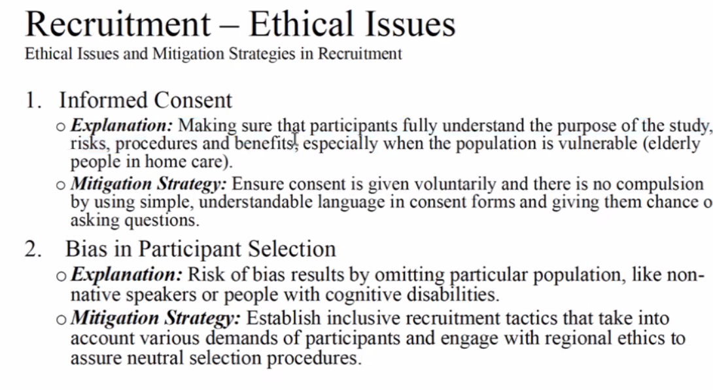
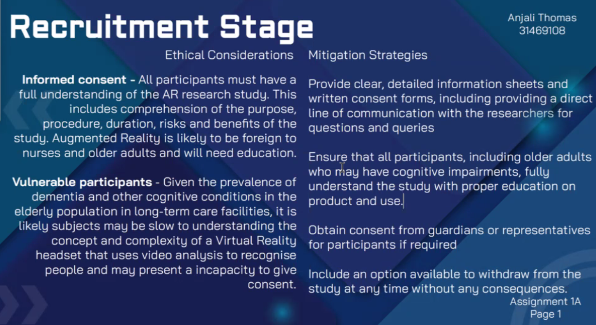
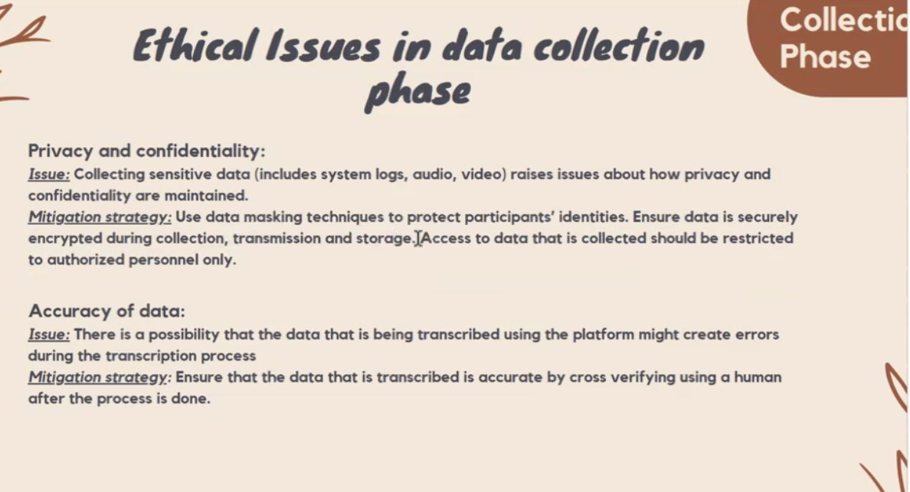
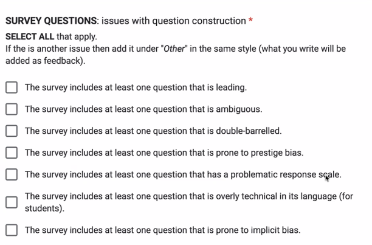

## How students engage with their families

## who will you interview?
students(with or without parents)
age: 16-30

## From where will you recruit these participants from?
social media recruiting

## How many?
200+
different region, culture background

## how long should these Interviews last?
12 questions
1-2 minutes 
maximum 30 min in total

recruit people , and then interview in University 

## Main key point
1. How often and how many hours/minutes do students communicate with their families
2. what difficulties do students face(why dont you communicate with your parents)
3. what tools or features would students find useful

## what method we use to get knowledge from these interiews?
1. a graph that contains the data of the question, like 

Using AI tools and fill in the details

scale for rating(for example 1 for strongly agree, 2 for little aggree)
focus on why is it instead of what it is

what it could change by using the platform

# Dimensions of Research Ethics
Physical/psych harm/abuse
Informed consent
Right of withdrawal
Vulnerable participants
Deception

#
 
### confidentiality

# Recruitment
# ethical issue in Recruitment phase

## Mitigation

# data collection

## samples of improvements
1. What is wrong with young people these days and what can we do about it?
   double-barrelled
   implicit qustions
   loaded questions(assume facts)
   leading question
    scale of age of young people(14-18)
    split into two questions
    are there any potential questions / what challenges do you think young people are facing?
    
2. Do you go swimming? [1] Never, [2] Rarely; [3] Frequently; [4] Sometimes
   ambiguous
   poor answer scale options
    once a month
3. What do you think can be done about global warming?
   

4. Most medical professionals think that smoking causes lung cancer; do you: [a]Strongly Agree; [b]
Agree; [c] Neither agree nor disagree; [d] Disagree; [e] Strongly disagree.
1. Do you agree that students should not have to take an exam at the end of their course? [a] Yes; [b] No.
2. Has your son ever stolen anything? If so when?
3. What do you think about the left-wing media’s attempt to blackmail the Government?
4. How much food do you think the average family throws away in a week?
5. How much do you earn?
6.  What is your ethnicity?
7.  

## quiz designing
### main topic:
### questions designing
