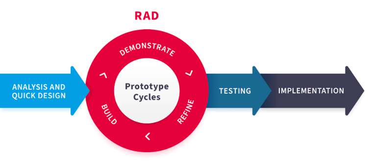
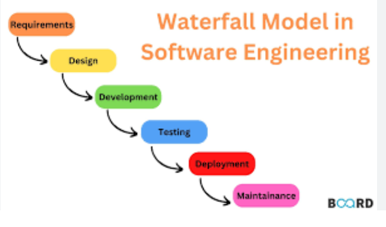

1. RAD lifecycle
 
 agile
mainly for user(
    shouldn't require any installation from the user and can be run immediately. 
    Your project manager has summarised the main features of the app as:

•  view a portfolio of existing projects (building plans by other customers)

•  start a new project

•  about us

 it would be good to have time to refine the app design through further iterations.
)
2. if you cant skip any step, (each step need signature and check), use waterfall

3.
4.
5.