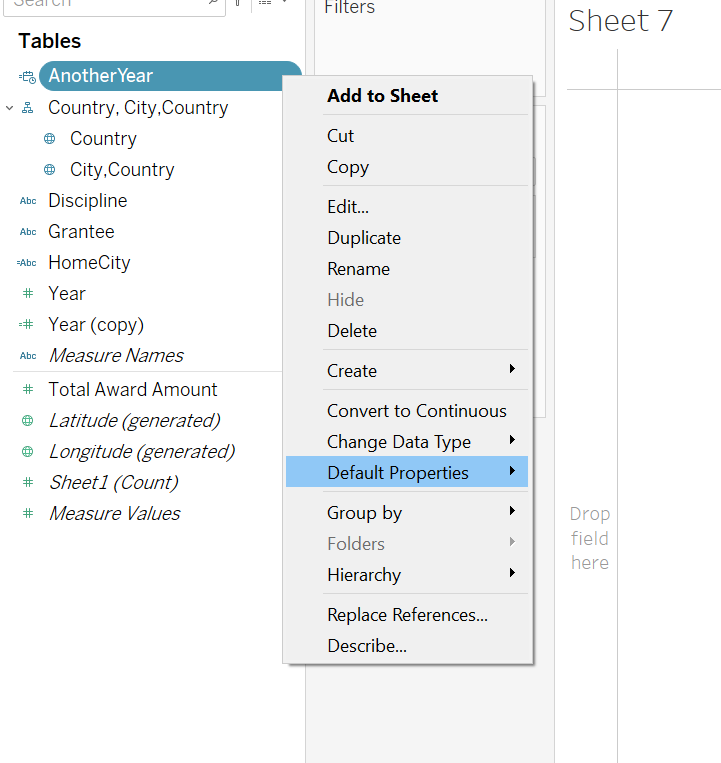
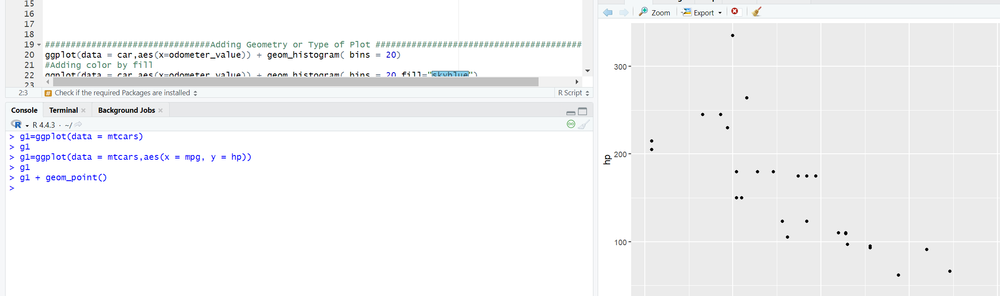

wrap-up is what you have to do

Week1: read the books
https://learning.monash.edu/mod/book/view.php?id=3760849
https://learning.monash.edu/mod/book/view.php?id=3760850
video: data expooration and visualisation monash
learn: javascript--learn how to use it and use live server to update the web
R language
GGplot
0
any problem in the question?
2 weeks to do it
use javascript for dap
for dvp you can use R or javascript

note for week2:
### assignment released and you need to do it before next Monday
# orderded and catagorical
## how to format/calculate or use tableau:
https://learning.monash.edu/mod/book/view.php?id=3760898

how to change the date format:

how to use GGplot
https://learning.monash.edu/mod/book/view.php?id=3760897

and there's a file in FIT5147 week2

initialising ggplot:
tools- install packages- ggplot2
run code:install.packages("ggplot2")

test:
