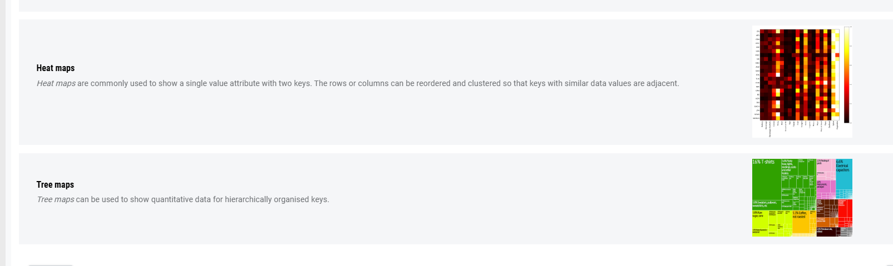
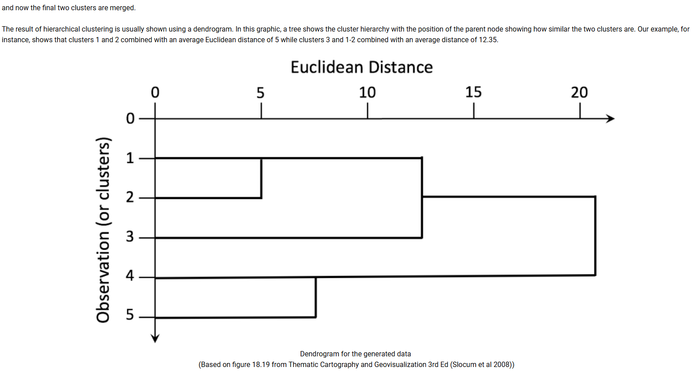

wrap-up is what you have to do

Week1: read the books
https://learning.monash.edu/mod/book/view.php?id=3760849
https://learning.monash.edu/mod/book/view.php?id=3760850
video: data expooration and visualisation monash
learn: javascript--learn how to use it and use live server to update the web
R language
GGplot
0
any problem in the question?
2 weeks to do it
use javascript for dap
for dvp you can use R or javascript

note for week2:
### assignment released and you need to do it before next Monday
# orderded and catagorical
## how to format/calculate or use tableau:
https://learning.monash.edu/mod/book/view.php?id=3760898

how to change the date format:

how to use GGplot
https://learning.monash.edu/mod/book/view.php?id=3760897

and there's a file in FIT5147 week2

initialising ggplot:
tools- install packages- ggplot2
run code:install.packages("ggplot2")

test:

## chart types:
https://learning.monash.edu/mod/book/view.php?id=3760881&chapterid=661049

## data type:
Tabular data
Spatial data
Network data
Textual data

## variable

Univariate analysis focuses on a single variable while bivariate analysis examines the relationship between two variables.

### ggplot commands
geom_bar(): creates a layer with bars representing different statistical properties.
geom_point(): creates a layer showing the data points (as you would see on a scatterplot).
geom_line(): creates a layer that connects data points with a straight line.
geom_smooth(): creates a layer that contains a ‘smoother’ (i.e., a line that summarizes the data as a whole rather than connecting individual data points).
geom_histogram(): creates a layer with a histogram on it.
geom_boxplot(): creates a layer with a box–whisker diagram.
geom_text(): creates a layer with text on it.
geom_density(): creates a layer with a density plot on it.
geom_errorbar(): creates a layer with error bars displayed on it.
geom_hline(), geom_vline(): straight lines

## data transformation

other kinds of curve fitting:

### Hierarchical clustering

## common analytics for Tabular Data
Aggregation
You might want to make generalizations so you can see how it affects certain categories rather than each item in the category. For example, If you've got privacy issues where you don't want to include every item of every observation.
Correlation
If we think there is a strong relationship between two variables, we say they have a high correlation. This means that if one changes, then the other will change as well.
Curve filtering / regression
We want to know which of the variables might change that dependent variable in some way.
Dimension reduction
Change the data from being thousands, millions of dimensions down into a small number of dimensions so that we can visualize easier and analyze in various ways.
Filtering
Sometimes we don't want to differentiate between different components of our population or sample population that the data relates to. For instance, we might decide that we want to look at if we're looking at most popular soft drinks, that we only want to look at the males in this population.
Clustering
Clustering analysis allows us to say which part of the data would be in which cluster, and what are the attributes of each cluster in accordance to the data?
Ranking/ordering
Reorder the categories so the distance between the maximum and minimum is clear as well as the similarity between the values for each category. How you ordered them could be based on the actual values, or you might actually have an established rank to order them by. For instance education level is ordered, but it doesn't have a value.
Factor analysis
Finds linear combinations of variables that best explain the relationships between the variables, through clustering the variables rather than the observations.
Summary statistics
Good for indicating how regular the values are, how spread out they are and suggest what sort of distribution they have. Indicates the general bias that might be possible in the data. It also helps us identify outliers and various patterns.

## efectiveness of visual variables

# codes for week4

### finding coordinates
library(tmaptools) # Convert location/address to its lat/long coordinates: 
myLocation4 <- geocode_OSM("Melbourne") 
myLocation4$coords

find location using library(ggmap)

library(ggmap) # load ggmap 

# Define location 3 ways 
# 1. location/address 
myLocation1 <- "Melbourne" 
myLocation1 

# 2. lat/long 
myLocation2 <- c(lon=-95.3632715, lat=29.7632836)  # not "Melbourne" 
myLocation2 

# 3. an area or bounding box (using 4 points),
#   lower left lon, 
#   lower left lat, 
#   upper right lon, 
#   upper right lat 
# (this can be a little glitchy for Google maps) 
myLocation3 <- c(-130, 30, -105, 50) 
myLocation3

### 
There are 4 key online map sources (online services), with multiple map types:

Stamen: “terrain”, “toner”, “watercolor” etc. (moved to Stadia in 2023, API key required, cf. https://github.com/dkahle/ggmap)
Google : “roadmap”, “terrain”, “satellite”, “hybrid” (API key required)
OSM: open source street maps
Cloudmade: thousands of maps (API key required)

These can be accessed using functions like get_stadiamap() for the bounding box surrounding the coordinates (you might need to transform the box coordinates into a vector). 

In R, try:

?get_stadiamap
# or help(get_stadiamap) 
# (Also try ?get_stamenmap, ?get_googlemap, ?get_openstreetmap and ?get_cloudmademap)
# to see something like:
Arguments described in the help message for the get_stadiamap function
The ?get_stadiamap function provides a general approach for quickly obtaining maps from multiple sources. It requires a bbox to define locations, but we can use the results from geocode_OSM.

You may be told to register your license key for the Stadia Maps API. For this, you should make sure your version of ggmap is up-to-date. A 2023 version of ggmap can't correctly access all the Stadia Map data, but they have prepared a version that fixes that.

remove.packages("ggmap") # get rid of the default version
install.packages("devtools")
devtools::install_github("stadiamaps/ggmap") # get a more recent trusted version
You will also need to get a API key from Stadia (register a free account, then get the API key by creating a Property then going to the Manage Properties tab) and register it on your device:

ggmap::register_stadiamaps("PASTEYOURLICENSEKEYHERE",write=TRUE)
The write=TRUE will make a copy of the key onto your device, so you don't need to register it every time you start RStudio. This will cost you nothing to use. Advice on this change can be found at https://github.com/dkahle/ggmap .

The following script will then create a map (it may take up to 10-20 seconds to finish).

#myLocation4 <- geocode_OSM("Melbourne") # previously done
bboxVector <- as.vector(myLocation4$bbox) 
bbox1 <- c( left = bboxVector[1], 
            bottom = bboxVector[2], 
            right = bboxVector[3], 
            top = bboxVector[4] ) 
myMap <- get_stadiamap( bbox = bbox1, 
                        maptype = "outdoors", 
                        zoom = 10 ) 
ggmap(myMap)
          
R map generated with Stadia outdoors tiles at Zoom 10
Try modifying the zoom down to 6 or up to 11 or changing the maptype to "stamen_terrain" or "stamen_toner". 

What changes on the map?

If you are using RStudio directly, you may get an error like:

Error: GeomRasterAnn was built with an incompatible version of ggproto.
Please reinstall the package that provides this extension 
or

Error in get(“f”, environment(CoordMap$train)) : object ‘f’ not found. 
This is because of some dependency conflicts between the older versions of R and the ggplot2 package. You will need to update your R packages first with (may take around 20 minutes):

update.packages(ask = FALSE, checkBuilt = TRUE)
After that, you need to install 2 packages:

install.packages(c("curl", "yaml"))
At last, you can solve this issue by installing the trusted github versions of the packages by:

install.packages("devtools") 
devtools::install_github("hadley/ggplot2@v2.2.0") # ggplot2 is now actually v3.4.4 (Feb 2024)
devtools::install_github("dkahle/ggmap")
And then restart your RStudio, and try the code again.

Step 3: Try some projections

The Mercator projection gives us equally spaced straight meridians, and conformal, straight compass courses. Let's then compare it with the Albers projection (named after Heinrich C. Albers), which is a conic, equal-area map projection that uses two standard parallels (see Albers projection (Wikipedia, n.d.). You can use the arrows in the RStudio Plots tab to compare them.

require(mapproj) 
# get map data (lat & lon for boundaries in this case) 
m <- map("usa", plot = FALSE) 

# try mercator first 
map(m, project = "mercator") 
map.grid(m) # draw graticules 

# change the projection to albers 
map(m, project = "albers", par=c(39,45)) 
map.grid(m) # draw graticules to compare more easily
What benefits do each of these projections offer?

Let’s move on to the whole world.

# get unprojected world limits 
m <- map('world', plot = FALSE) 
# center on New York 
map(m, 
    proj = 'azequalarea', 
    orient = c(41,-74,0)) 
map.grid(m, col = 2) # draw graticules
Now it's your turn to use R to rotate the map to show Australia.

Step 4: ‘X’ marker on the map

We can use a marker (like a circle or X) to highlight landmarks or places of interest, like cities.

map(m, 
    proj = 'orth', 
    orient = c(41,-74,0)) 
map.grid(m, col = 2, nx = 6, ny = 5, label = FALSE, lty = 2) 
points( mapproject( list(y = 41, x = -74) ), 
        col = 3,
        pch = "x", 
        cex = 2 )
        # centre on NY
Change this so that it instead centres on Melbourne with a red "o".

Step 5: Label the map

You can also add more labels to better explain the map to any user.

map("state", 
    proj='bonne', 
    param=45) 
data(state) 
text( mapproject( state.center ), 
      state.abb )
You may also want to try:

map("state",
          proj='bonne', 
          param=45) 
    text( mapproject( state.center, 
                      proj='bonne', 
                      param=45 ), 
          state.abb )
However, this does not work well. This is because the default orientations for map and mapproject are different.

Step 6: Data on a map using a quick map plot

Let’s look at the data first. We are going to use the ggmap built-in data set crime.

help(crime) 
head(crime)
This data set is pretty large, so we will choose a subset from it and plot it using qmplot().

murder <- subset(crime, offense == "murder") 
qmplot(lon, 
       lat, 
       data = murder, 
       colour = I('red'), 
       size = I(3), 
       darken = .3 )
What improvements would you make to this map?

Can they be done using qmplot?

Step 7: Choropleth Map

We are going to create a choropleth map of the unemployed rate of the USA. Two data sets will be used here: unemp and county.fips. The first step, as always, is to have a look at data sets.

help(unemp) 
head(unemp) 
help(county.fips) 
head(county.fips)
Let’s pre-processing the data. We want to split the unemployed rate into 7 intervals (“<2%”, ”2-4%”, ”4-6%”, ”6-8%”, ”8-10%”, ”>10%”).

# use the version installed with maps library! 
data(unemp) 
# set up intervals 
Intervals <- as.numeric( cut( unemp$unemp, 
                              c(0,2,4,6,8,10,100) ) )
Then we need to match the unemployment data to the map regions according to the US Federal Information Processing Standards (FIPS) codes.

data(county.fips) 
Matches <- Intervals[ match( county.fips$fips, 
                              unemp$fips ) ]
After that, we can prepare the colour schema and plot the map.

colors <- c("#ffffd4","#fee391","#fec44f","#fe9929","#d95f0e","#993404") 
# draw the map 
map("county", 
    col = colors[Matches], 
    fill = TRUE, 
    resolution = 0, 
    lty = 0, 
    projection = "polyconic" )    
The resulting map is very colourful, but it is not clear where all the regions are located. Including the state boundaries will improve the map.

# draw state boundaries 
map("state", 
    col = "purple", 
    fill = FALSE, 
    add = TRUE, 
    lty = 1, 
    lwd = 1.3, 
    projection = "polyconic" )
Never forget to include the title and legend!

# add title and legend 
title("Unemployment by county, 2009") 
Legend <- c("<2%","2-4%","4-6%","6-8%","8-10%",">10%") 
legend("topright", 
       Legend, 
       horiz = TRUE, 
       fill = colors)
Your turn! Change the intervals to (“<5%”,”5-10%”,”10-15%”,”15-20%”,”20-25%”,”>25%”).

Step 8: Flow Map (based on How to map connections with great circles (Yau, n.d.))

Let’s look at how to draw a line on the map.

Note: the shortest path between two locations is usually not a straight line on a map, because of the map projection. The shortest path is always the “great circle” that passes through the two points. This is not the same as the path travelled by a vehicle travelling on a fixed bearing which is what is shown on as a straight line using the Mercator projection.

library(geosphere) 
map("state")
lat_ca <- 39.164141 
lon_ca <- -121.640625 
lat_me <- 45.213004 
lon_me <- -68.906250 
inter <- gcIntermediate( c(lon_ca,lat_ca), 
                         c(lon_me,lat_me), 
                         n = 50, 
                         addStartEnd=TRUE ) 
lines(inter)
        
Now we can draw lines of flights. Again, let’s look at the data first (copies are also available on Moodle).

airports <- read.csv("http://datasets.flowingdata.com/tuts/maparcs/airports.csv", 
                     header = TRUE)

flights <-read.csv("http://datasets.flowingdata.com/tuts/maparcs/flights.csv", 
                   header = TRUE, 
                   as.is = TRUE) 

head(airports) 
head(flights) 
Plot the map and flights.

# create a world map and limited it to around US areas. 
xlim <- c(-171.738281, -56.601563) 
ylim <- c(12.039321, 71.856229) 
map( "world", 
     col = "#f2f2f2",
     fill = TRUE, 
     bg = "white", 
     lwd = 0.05, 
     xlim = xlim, 
     ylim = ylim ) 
     
# get the flights by AA
fsub <- flights[flights$airline == "AA",] 

# plot each flight path on the map
for(j in 1:length(fsub$airline)) { 
    air1 <- airports[ airports$iata == fsub[ j,]$airport1,] 
    air2 <- airports[ airports$iata == fsub[ j,]$airport2,] 
    inter <- gcIntermediate( c( air1[1,]$long, air1[1,]$lat ), 
                             c( air2[1,]$long, air2[1,]$lat ), 
                             n = 100, 
                             addStartEnd = TRUE ) 
    lines(inter, col="black", lwd=0.8) }
So what can/can’t you do with ggmap? 

Compare these R tools with other options, e.g., GIS tools, also Tableau Public, Google FusionTables.

# DVP assignment

you can only use R(shiny ) or D3.js
### sheet 1 : idea sheet
