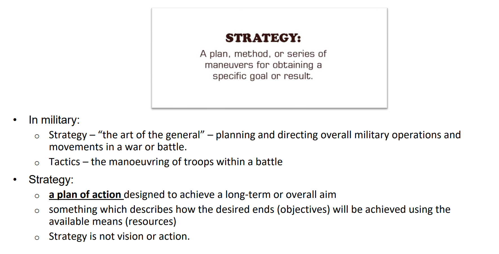
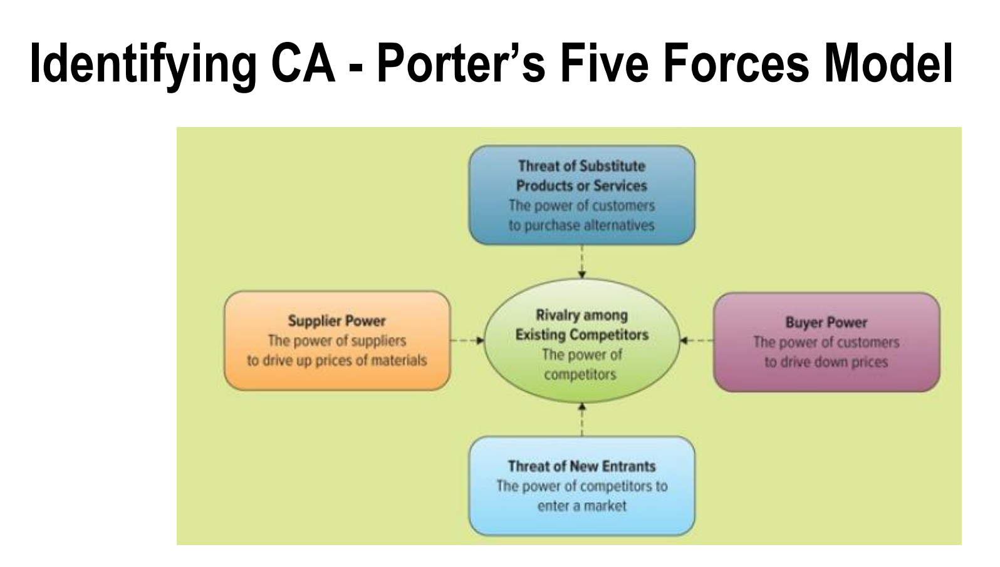
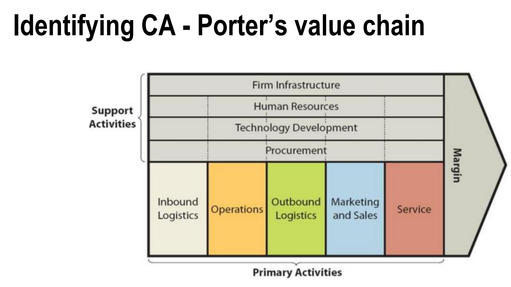
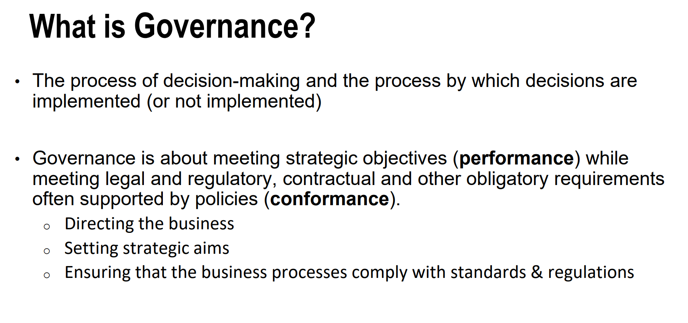
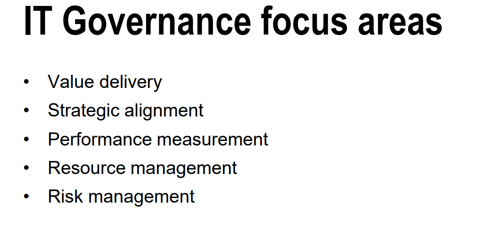
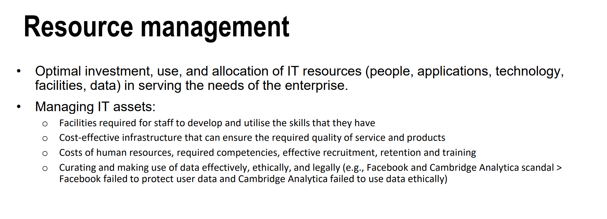
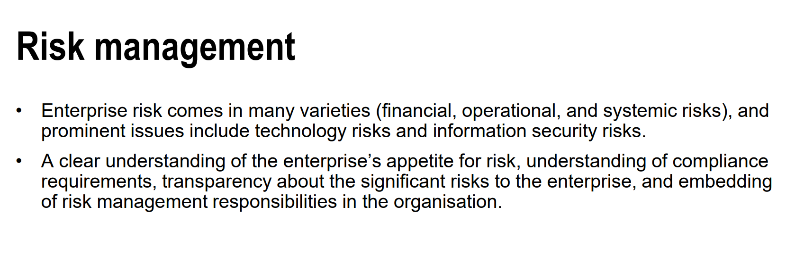
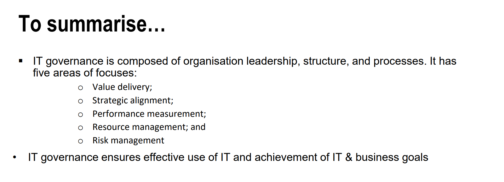

warning: for assignments you need to do further researches and make sure all what you're writing includes references

how to write in the final exam:
must include key point
if you dont know how to write:
search for this thesis on google scholar: The Relationship between Strategic Information
Systems Planning Facilitators and the Success of
South Korean Organisations

these questions will be in final exam:
 
 

strategy:
(the tutor always talk about the monash university 5-year strategy plan)

Governance

